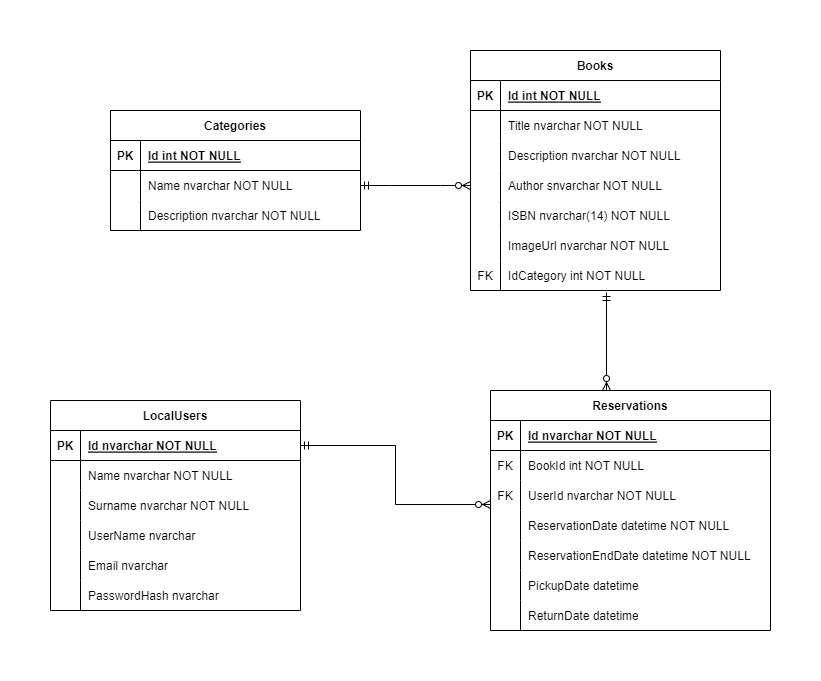

<h1 align="center" style="display:flex;justify-content:center; align-items:center;"> Book Reservation</h1>

  

   
  
  
  
  

## ✍ Descripción:
Proyecto de RESTful API desarrollado en .NET 7 utilizando el framework ASP.NET. Diseñado para gestionar reservas de libros en una biblioteca. Proporciona una interfaz robusta para crear, leer, actualizar y eliminar libros, así como la administración de reservas por parte de usuarios.

## 📜 Características
- **Documentación con Swagger:** La documentación del API fue generada con Swagger, lo que brinda una interfaz interactiva que ofrece información detallada sobre los endpoints, parámetros y ejemplos de requests y response posibles.
- **ASP.NET Identity:** El API utiliza ASP.NET Identity para administrar la autenticación y autorización. Se utilizan JSON Web Tokens como método de autenticación seguro. Los usuarios pueden obtener un token JWT válido a través del login y pueden usarlo para las request en el API.
- **Entity Framework Core:** La persistencia de datos dentro del API se lleva a cabo utilizando el ORM Entity Framework Core y Microsoft SQL Server como sistema de gestión de base de datos.
## 📁 Esquema Visual de la Base de Datos

	

